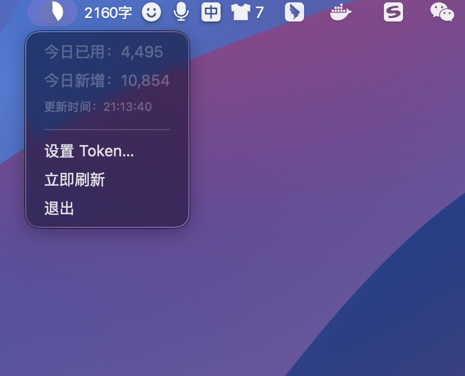

# TokenUsage

macOS 菜单栏应用，用于实时监控 [ppchat.vip](https://ppchat.vip) AI 服务的 Token 配额使用情况。

## 功能

- 菜单栏饼图图标，直观展示配额使用比例
- 每 10 秒自动轮询，实时更新用量数据
- 显示当日已用配额与新增配额
- 支持手动设置和更换 Token Key

## 截图

## 下载

前往 [Releases](../../releases) 页面下载最新的 `.dmg` 文件，打开后将应用拖入 Applications 即可。

## 要求

- macOS 26.0+
- Xcode 26+（仅开发需要）

## 构建与运行

1. 克隆仓库
2. 用 Xcode 打开 `TokenUsage.xcodeproj`
3. `Cmd + R` 运行
4. 在菜单栏点击图标，设置你的 Token Key

## 技术栈

- Swift / SwiftUI
- MVVM 架构
- MenuBarExtra API

## License

MIT
